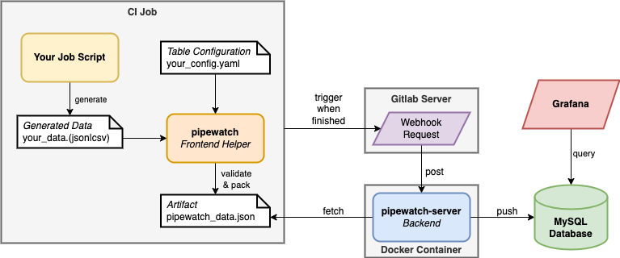

## Overview

The following diagram shows the architecture of the `pipewatch` dashboard system:

It is composed of the following components:

- **CI Job**: The CI job that generates the data, prepares them and stores them as an artifact with the help of the `pipewatch` CLI tool.
- **`pipewatch`**: The helper client that validates and prepares the data for the backend server according to the table configuration.
- **Gitlab Server**: The Gitlab server triggers the webhook that send the data to the backend server.
- **`pipewatch-server`**: The backend server that receives the data from the pipelines and stores it in the database.
- **MySQL**: The database that stores the data.
- **Grafana**: The dashboard system that visualizes the data.
